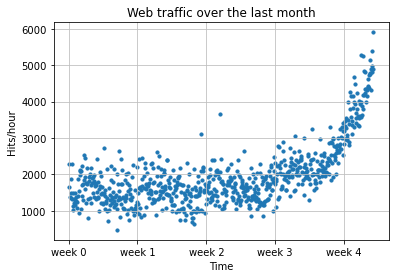
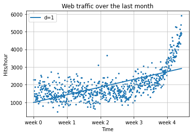
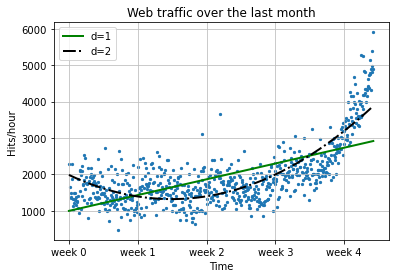
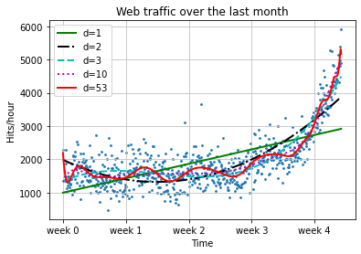
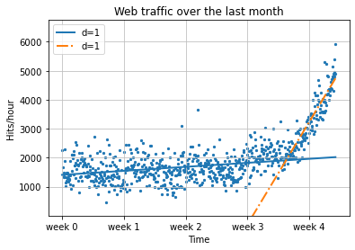
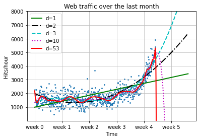
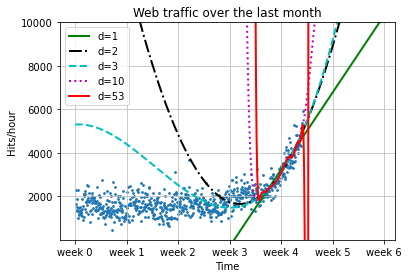

# Learning NumPy


```python
import numpy as np
np.version.full_version
```


    '1.19.1'


```python
a = np.array([0,1,2,3,4,5])
a
```


    array([0, 1, 2, 3, 4, 5])


```python
a.ndim
```


    1


```python
a.shape
```


    (6,)


```python
b = a.reshape((3,2))
b
```


    array([[0, 1],
           [2, 3],
           [4, 5]])


```python
b.ndim
```


    2


```python
b.shape
```


    (3, 2)


```python
b[1][0] = 77
b
```


    array([[ 0,  1],
           [77,  3],
           [ 4,  5]])


```python
a
```


    array([ 0,  1, 77,  3,  4,  5])


```python
c = a.reshape((3,2)).copy()
c
```


    array([[ 0,  1],
           [77,  3],
           [ 4,  5]])


```python
c[0][0] = -99
a
```


    array([ 0,  1, 77,  3,  4,  5])


```python
c
```


    array([[-99,   1],
           [ 77,   3],
           [  4,   5]])


```python
d = np.array([1,2,3,4,5])
d*2
```


    array([ 2,  4,  6,  8, 10])


```python
d**2
```


    array([ 1,  4,  9, 16, 25], dtype=int32)


```python
[1,2,3,4,5]*2
```


    [1, 2, 3, 4, 5, 1, 2, 3, 4, 5]


```python
[1,2,3,4,5]**2
```


    ---------------------------------------------------------------------------

    TypeError                                 Traceback (most recent call last)

    <ipython-input-42-bdad266e9782> in <module>
    ----> 1 [1,2,3,4,5]**2
    

    TypeError: unsupported operand type(s) for ** or pow(): 'list' and 'int'


# Indexing


```python
a[np.array([2,3,4])]
```


    array([77,  3,  4])


```python
a>4
```


    array([False, False,  True, False, False,  True])


```python
a[a>4]
```


    array([77,  5])


```python
a[a>4] = 4
a
```


    array([0, 1, 4, 3, 4, 4])


```python
a.clip(0,4)
```


    array([0, 1, 4, 3, 4, 4])


# Handling nonexisting values


```python
c = np.array([1, 2, np.NAN, 3, 4]) # let's pretend we have read this from a text file
c
```


    array([ 1.,  2., nan,  3.,  4.])


```python
np.isnan(c)
```


    array([False, False,  True, False, False])


```python
c[~np.isnan(c)]
```


    array([1., 2., 3., 4.])


```python
np.mean(c[~np.isnan(c)])
```


    2.5


# Comparing the runtime


```python
import timeit
normal_py_sec = timeit.timeit('sum(x*x for x in range(1000))', number=10000)
naive_np_sec = timeit.timeit('sum(na*na)', setup="import numpy as np; na=np.arange(1000)", number=10000)
good_np_sec = timeit.timeit('na.dot(na)', setup="import numpy as np; na=np.arange(1000)", number=10000)
print("Normal Python: %f sec" % normal_py_sec)
print("Naive NumPy: %f sec" % naive_np_sec)
print("Good NumPy: %f sec" % good_np_sec)
```

    Normal Python: 0.792952 sec
    Naive NumPy: 1.508449 sec
    Good NumPy: 0.013259 sec
    


```python
a = np.array([1,2,3])
a.dtype
```


    dtype('int32')


```python
np.array([1, "stringy"])
```


    array(['1', 'stringy'], dtype='<U11')


```python
np.array([1, "stringy", {1, 2, 3}])
```


    array([1, 'stringy', {1, 2, 3}], dtype=object)


# Learning SciPy


```python
import scipy, numpy
scipy.version.full_version
```


    '1.5.4'


```python
scipy.dot is numpy.dot
```


    False


# Our first (tiny) application of machine learning:

# 1. Reading in the data


```python
import scipy as sp 
import numpy as np
data = np.genfromtxt("web_traffic.tsv", delimiter="\t")
"""" the reason np.genfromtxt is used instead of sp.genfromtxt:
ipython-input-53-c83431deec26>:2: DeprecationWarning: scipy.genfromtxt is deprecated and will be removed in SciPy 2.0.0, use numpy.genfromtxt instead data = sp.genfromtxt("web_traffic.tsv", delimiter="\t")"""
print(data[:10])
```

    [[1.00000000e+00 2.27333106e+03]
     [2.00000000e+00 1.65725549e+03]
     [3.00000000e+00            nan]
     [4.00000000e+00 1.36684644e+03]
     [5.00000000e+00 1.48923438e+03]
     [6.00000000e+00 1.33802002e+03]
     [7.00000000e+00 1.88464734e+03]
     [8.00000000e+00 2.28475415e+03]
     [9.00000000e+00 1.33581091e+03]
     [1.00000000e+01 1.02583240e+03]]
    


```python
print(data.shape)
```

    (743, 2)
    

# 2. Preprocessing and cleaning the data


```python
x = data[:,0]
y = data[:,1]
np.sum(np.isnan(y))
```


    8


```python
x = x[~np.isnan(y)]
y = y[~np.isnan(y)]
```


```python
import matplotlib.pyplot as plt
# plot the (x,y) points with dots of size 10
plt.scatter(x, y, s=10)
plt.title("Web traffic over the last month")
plt.xlabel("Time")
plt.ylabel("Hits/hour")
plt.xticks([w*7*24 for w in range(10)], ['week %i' % w for w in range(10)])
plt.autoscale(tight=False)
# draw a slightly opaque, dashed grid
plt.grid(True, linestyle='-', color='0.75')
plt.show()
```


    

    


# 3. Choosing the right model and learning algorithm


```python
def error(f, x, y):
    return np.sum((f(x)-y)**2)
```


```python
fp1, residuals, rank, sv, rcond = np.polyfit(x, y, 1, full=True)
```


```python
print("Model parameters: %s" % fp1)
```

    Model parameters: [  2.58462016 996.50674246]
    


```python
print(residuals)
```

    [3.19531507e+08]
    


```python
f1 = sp.poly1d(fp1)
print(error(f1, x, y))
```

    319531507.0208318
    


```python
fx = np.linspace(0,x[-1], 1000) # generate X-values for plotting
plt.plot(fx, f1(fx), linewidth=2)
plt.legend(["d=%i" % f1.order], loc="upper left")

plt.scatter(x, y, s=5)
plt.title("Web traffic over the last month")
plt.xlabel("Time")
plt.ylabel("Hits/hour")
plt.xticks([w*7*24 for w in range(10)], ['week %i' % w for w in range(10)])
plt.autoscale(tight=False)
# draw a slightly opaque, dashed grid
plt.grid(True, linestyle='-', color='0.75')
plt.show()
```


    

    


# Towards some advanced stuff


```python
f2p = np.polyfit(x, y, 2)
print(f2p)
```

    [ 1.05605675e-02 -5.29774287e+00  1.98466917e+03]
    


```python
f2 = sp.poly1d(f2p)
print(error(f2, x, y))
```

    181347660.75761026
    


```python
fx = np.linspace(0,x[-1], 1000) # generate X-values for plotting
plt.plot(fx, f1(fx), color='g', linewidth=2)
plt.plot(fx, f2(fx), color='k', linestyle='dashdot', linewidth=2)
plt.legend(["d=%i" % f1.order, "d=%i" % f2.order], loc="upper left")

plt.scatter(x, y, s=5)
plt.title("Web traffic over the last month")
plt.xlabel("Time")
plt.ylabel("Hits/hour")
plt.xticks([w*7*24 for w in range(10)], ['week %i' % w for w in range(10)])
plt.autoscale(tight=False)
# draw a slightly opaque, dashed grid
plt.grid(True, linestyle='-', color='0.75')
plt.show()
```


    

    


```python
f3p = np.polyfit(x, y, 3)
f3 = sp.poly1d(f3p)
```


```python
f10p = np.polyfit(x, y, 10)
f10 = sp.poly1d(f10p)
```


```python
f53p = np.polyfit(x, y, 53)
f53 = sp.poly1d(f53p)
```

    C:\Users\neha\AppData\Roaming\Python\Python38\site-packages\IPython\core\interactiveshell.py:3417: RankWarning: Polyfit may be poorly conditioned
      exec(code_obj, self.user_global_ns, self.user_ns)
    


```python
fx = np.linspace(0,x[-1], 1000) # generate X-values for plotting
plt.plot(fx, f1(fx), color='g', linewidth=2)
plt.plot(fx, f2(fx), color='k', linestyle='dashdot', linewidth=2)
plt.plot(fx, f3(fx), color='c', linestyle='dashed', linewidth=2)
plt.plot(fx, f10(fx), color='m', linestyle='dotted', linewidth=2)
plt.plot(fx, f53(fx), color='r', linewidth=2)
plt.legend(["d=%i" % f1.order, "d=%i" % f2.order, "d=%i" % f3.order, "d=%i" % f10.order, "d=%i" % f53.order], loc="upper left")

plt.scatter(x, y, s=3)
plt.title("Web traffic over the last month")
plt.xlabel("Time")
plt.ylabel("Hits/hour")
plt.xticks([w*7*24 for w in range(10)], ['week %i' % w for w in range(10)])
plt.autoscale(tight=False)
# draw a slightly opaque, dashed grid
plt.grid(True, linestyle='-', color='0.75')
plt.show()
```


    

    


```python
print(error(f1, x, y))
print(error(f2, x, y))
print(error(f3, x, y))
print(error(f10, x, y))
print(error(f53, x, y))
```

    319531507.0208318
    181347660.75761026
    140576460.87968162
    123426935.75171934
    110768247.48243403
    

# Stepping back to go forward – another look at our data


```python
inflection = int(3.5*7*24) # calculate the inflection point in hours
xa = x[:inflection] # data before the inflection point
ya = y[:inflection]
xb = x[inflection:] # data after
yb = y[inflection:]

fa = sp.poly1d(sp.polyfit(xa, ya, 1))
fb = sp.poly1d(sp.polyfit(xb, yb, 1))

fa_error = error(fa, xa, ya)
fb_error = error(fb, xb, yb)
print("Error inflection = %f" % (fa_error + fb_error))
```

    Error inflection = 134390576.312955
    

    <ipython-input-175-ba031fb54772>:7: DeprecationWarning: scipy.polyfit is deprecated and will be removed in SciPy 2.0.0, use numpy.polyfit instead
      fa = sp.poly1d(sp.polyfit(xa, ya, 1))
    <ipython-input-175-ba031fb54772>:8: DeprecationWarning: scipy.polyfit is deprecated and will be removed in SciPy 2.0.0, use numpy.polyfit instead
      fb = sp.poly1d(sp.polyfit(xb, yb, 1))
    


```python
fx = np.linspace(0,x[-1], 1000) # generate X-values for plotting
plt.plot(fx, fa(fx), linewidth=2)
plt.plot(fx, fb(fx), linestyle='dashdot', linewidth=2)
plt.legend(["d=%i" % fa.order, "d=%i" % fb.order], loc="upper left")

plt.scatter(x, y, s=5)
plt.title("Web traffic over the last month")
plt.xlabel("Time")
plt.ylabel("Hits/hour")
plt.xticks([w*7*24 for w in range(10)], ['week %i' % w for w in range(10)])
plt.autoscale(tight=False)
plt.ylim(bottom = 1)
# draw a slightly opaque, dashed grid
plt.grid(True, linestyle='-', color='0.75')
plt.show()
```


    

    


```python
fx = np.linspace(0,x[-1]+200, 1000) # generate X-values for plotting
plt.plot(fx, f1(fx), color='g', linewidth=2)
plt.plot(fx, f2(fx), color='k', linestyle='dashdot', linewidth=2)
plt.plot(fx, f3(fx), color='c', linestyle='dashed', linewidth=2)
plt.plot(fx, f10(fx), color='m', linestyle='dotted', linewidth=2)
plt.plot(fx, f53(fx), color='r', linewidth=2)
plt.legend(["d=%i" % f1.order, "d=%i" % f2.order, "d=%i" % f3.order, "d=%i" % f10.order, "d=%i" % f53.order], loc="upper left")

plt.scatter(x, y, s=3)
plt.title("Web traffic over the last month")
plt.xlabel("Time")
plt.ylabel("Hits/hour")
plt.xticks([w*7*24 for w in range(10)], ['week %i' % w for w in range(10)])
plt.autoscale(tight=False)
plt.ylim(bottom = 1)
plt.ylim(top = 8000)

# draw a slightly opaque, dashed grid
plt.grid(True, linestyle='-', color='0.75')
plt.show()
```


    

    


```python
fx = np.linspace(0,x[-1]+250, 1000) # generate X-values for plotting

fc = sp.poly1d(sp.polyfit(xb, yb, 2))
fd = sp.poly1d(sp.polyfit(xb, yb, 3))
fe = sp.poly1d(sp.polyfit(xb, yb, 10))
ff = sp.poly1d(sp.polyfit(xb, yb, 53))
    
plt.plot(fx, fb(fx), color='g', linewidth=2)
plt.plot(fx, fc(fx), color='k', linestyle='dashdot', linewidth=2)
plt.plot(fx, fd(fx), color='c', linestyle='dashed', linewidth=2)
plt.plot(fx, fe(fx), color='m', linestyle='dotted', linewidth=2)
plt.plot(fx, ff(fx), color='r', linewidth=2)

plt.legend(["d=%i" % fb.order, "d=%i" % fc.order, "d=%i" % fd.order, "d=%i" % fe.order, "d=%i" % ff.order], loc="upper left")

plt.scatter(x, y, s=3)
plt.title("Web traffic over the last month")
plt.xlabel("Time")
plt.ylabel("Hits/hour")
plt.xticks([w*7*24 for w in range(10)], ['week %i' % w for w in range(10)])
plt.autoscale(tight=False)
plt.ylim(bottom = 1)
plt.ylim(top = 10000)
# draw a slightly opaque, dashed grid
plt.grid(True, linestyle='-', color='0.75')
plt.show()
```

    <ipython-input-238-3d567d785fc8>:3: DeprecationWarning: scipy.polyfit is deprecated and will be removed in SciPy 2.0.0, use numpy.polyfit instead
      fc = sp.poly1d(sp.polyfit(xb, yb, 2))
    <ipython-input-238-3d567d785fc8>:4: DeprecationWarning: scipy.polyfit is deprecated and will be removed in SciPy 2.0.0, use numpy.polyfit instead
      fd = sp.poly1d(sp.polyfit(xb, yb, 3))
    <ipython-input-238-3d567d785fc8>:5: DeprecationWarning: scipy.polyfit is deprecated and will be removed in SciPy 2.0.0, use numpy.polyfit instead
      fe = sp.poly1d(sp.polyfit(xb, yb, 10))
    <ipython-input-238-3d567d785fc8>:5: RankWarning: Polyfit may be poorly conditioned
      fe = sp.poly1d(sp.polyfit(xb, yb, 10))
    <ipython-input-238-3d567d785fc8>:6: DeprecationWarning: scipy.polyfit is deprecated and will be removed in SciPy 2.0.0, use numpy.polyfit instead
      ff = sp.poly1d(sp.polyfit(xb, yb, 53))
    <ipython-input-238-3d567d785fc8>:6: RankWarning: Polyfit may be poorly conditioned
      ff = sp.poly1d(sp.polyfit(xb, yb, 53))
    


    

    


```python

```
